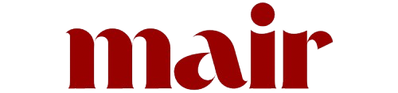

<p align="center">
  <br>
</p>

<p align="center">
  <strong>Moroccan Open Source AI Catalog</strong><br>
  A curated catalog of open-source AI projects built by Moroccans, in Morocco, or for Moroccan problems.
</p>

<p align="center">
  <a href="https://mosaic.mair.com/">
    
  </a>
  
  <a href="https://discord.gg/g5YQH3U8Uf">
    
  </a>
  <a href="CONTRIBUTING.md">
    
  </a>
  
</p>

It is a curated, community-friendly catalog of open-source AI software connected to Morocco. It highlights libraries, datasets, models, tools, platforms, and other artifacts built by Moroccans, developed in Morocco, or designed for Moroccan problems and communities. MOSAIC is part of the MAIR ecosystem and aims to make Moroccan AI work easier to discover, reuse, and understand.

## Why this exists

Moroccan AI work is often scattered across personal GitHub accounts, labs, startups, universities, Hugging Face pages, and research artifacts.

MOSAIC helps:
- showcase Moroccan open-source AI
- make useful projects easier to discover and reuse
- connect builders, researchers, students, and institutions
- highlight tools solving Moroccan and regional problems
- create a clean dataset for reporting and ecosystem analysis

## What this repository is

This repository is **not** a product codebase. It is a **structured catalog**.

The main source of truth is:

- [`catalog/mosaic.json`](catalog/mosaic.json)

The catalog is supported by:
- a simple JSON schema in [`catalog/schema.json`](catalog/schema.json)
- taxonomy files in [`taxonomy/`](taxonomy/)
- contributor guidance in [`CONTRIBUTING.md`](CONTRIBUTING.md)
- review and governance docs in [`docs/`](docs/)

## Repository structure

```text
catalog/
  mosaic.json
  schema.json
  featured.json
  mosaic-badge.json
  insights.json

taxonomy/
  platform.json
  domains.json
  types.json
  status.json

docs/
  schema.md
  review-policy.md
  governance.md

scripts/
  validate_catalog.py
  update_mosaic_badge.py

.github/
  ISSUE_TEMPLATE/
  workflows/
```

## The MOSAIC JSON structure

Each project in `catalog/mosaic.json` follows this structure:

```json
{
  "name": "Project Name",
  "description": "One sentence on what it does. One sentence on why it matters.",
  "url": ["https://github.com/org/repo"],
  "platform": ["github"],
  "type": ["library"],
  "domain": ["general-purpose-ai"],
  "tags": ["open-source", "morocco", "research"],
  "affiliations": ["University Name", "Company Name"],
  "sub_affiliations": ["Department Name", "Lab Name"],
  "language": ["Python"],
  "license": "MIT",
  "doi": null,
  "status": "active",
  "created_at": "YYYY-MM-DD"
}
```

### Notes
- `url` is a list because a project can have more than one public link
- `platform` is a list and should match `url` in the same order when possible
- `type`, `domain`, and `language` are lists so projects can be classified in more than one way
- `affiliations` should contain broad organizations
- `sub_affiliations` should contain departments, labs, centers, or units
- use lowercase values for controlled fields such as `type`, `domain`, and `status`

## How to contribute

The easiest way is to use the **Submit project** issue template.

You can also open a pull request and edit:
- [`catalog/mosaic.json`](catalog/mosaic.json)
- one or more files in [`taxonomy/`](taxonomy/) if a valid category is missing

Please read:
- [CONTRIBUTING.md](CONTRIBUTING.md)
- [docs/review-policy.md](docs/review-policy.md)
- [CODE_OF_CONDUCT.md](CODE_OF_CONDUCT.md)

## Proposing new domains or categories

If the right label does not exist yet:
1. open an issue, or
2. open a pull request updating the relevant file in `taxonomy/`

Please add:
- a short name
- a clear description
- a reason why it is needed

## License

The catalog metadata in this repository is released under the repository license.

Each linked project keeps its own license.

## Code of conduct

Please read [CODE_OF_CONDUCT.md](CODE_OF_CONDUCT.md).

## Disclaimer

Inclusion in MOSAIC does not imply endorsement. The goal is ecosystem visibility, discoverability, and reuse.
